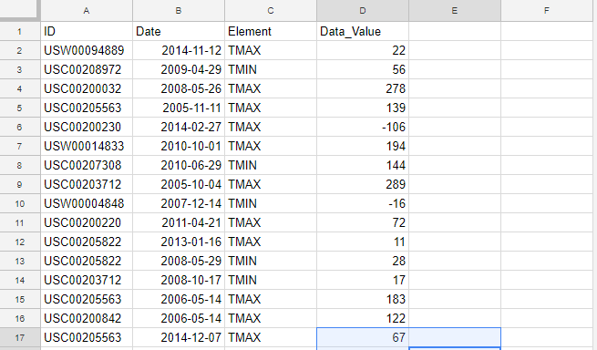
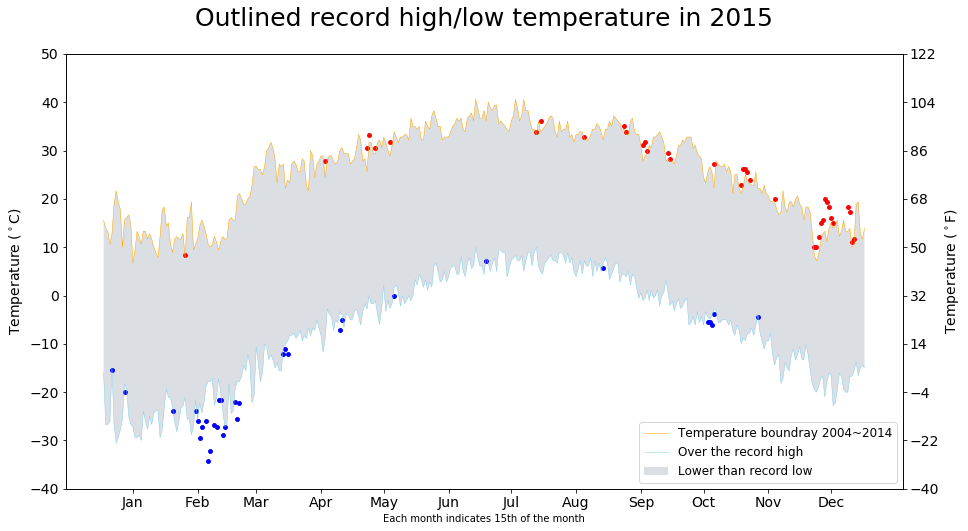

# Temperature overshooting - Global warming
## Data Visualization
[Direct link](Dataviz-GlobalWarming.ipynb)

Using the data, I found the temperature boundray is getting extreme.

 
**raw data**

 * **id** : station identification code
 * **date** : date in YYYY-MM-DD format (e.g. 2012-01-24 = January 24, 2012)
 * **element** : indicator of element type
     * TMAX : Maximum temperature (tenths of degrees C)
     * TMIN : Minimum temperature (tenths of degrees C)
 * **value** : data value for element (tenths of degrees C)
 
 

**result image**

